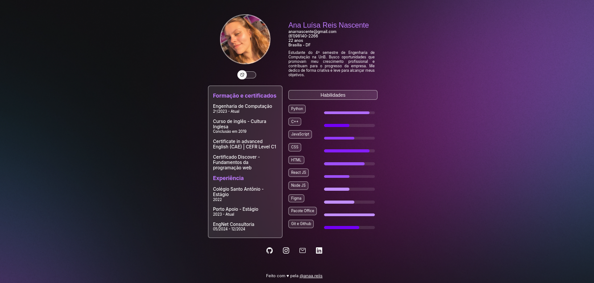

# 🌐 Desafio 1 — Frontend 2024.1

Projeto individual desenvolvido como parte do **Desafio 1 de Frontend** do processo treinee da **EngNet**.  
O objetivo foi aplicar conceitos fundamentais de HTML, CSS e JavaScript para criar uma página interativa, responsiva e visualmente agradável.

---

## ✨ Demonstração

👉 [Acesse o projeto online](https://anaareiis.github.io/Desafio-1-2024.1-Frontend/)  

Ou visualize o design abaixo:  


---

## 🧩 Estrutura do Projeto

```bash
.
├── src/ # Código-fonte principal
│ ├── index.html
│ ├── style.css
│ └── script.js
├── assets/ # Imagens e ícones
│ ├── logo.png
│ └── ...
├── docs/ # Documentação e prints
│ ├── DESAFIO.md
│ └── preview.png
└── README.md
```

---

## 🧠 Tecnologias Utilizadas

- **HTML5** → estrutura semântica da página  
- **CSS3** → layout responsivo e animações suaves  
- **JavaScript (ES6)** → interatividade e modo escuro  

---

## 🚀 Funcionalidades

✅ Botões com feedback visual  
✅ Modo claro/escuro com um clique  
✅ Layout responsivo para mobile e desktop  
✅ Links e navegação funcionais  
✅ Animações leves para melhor UX  

---

## 📦 Como Executar

1. Clone o repositório:
	```bash
	git clone https://github.com/anaareiis/Desafio-1-2024.1-Frontend.git
	cd Desafio-1-2024.1-Frontend


Abra o arquivo:

src/index.html


Execute no navegador ou use a extensão Live Server do VS Code.

👩‍💻 Autora

Ana Reis
Desenvolvido individualmente como parte do Desafio 1 de Frontend — 2024.1.

📜 Licença

Distribuído sob a licença MIT. Consulte o arquivo LICENSE para mais detalhes.

